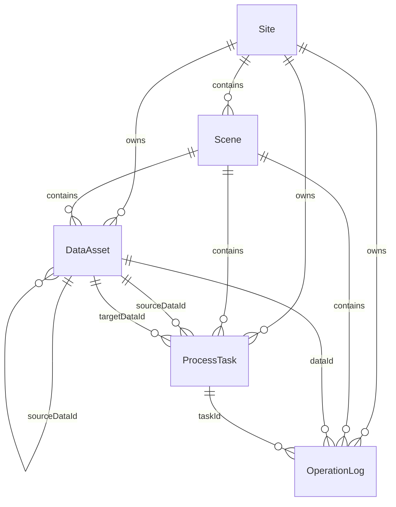

# 数据库表介绍文档

## 1. 文档说明

- 文档用途：说明当前 `backend-demo` 项目的数据库表设计、字段含义、关系、索引和已知约束。
- 判定依据：以 `prisma/schema.prisma`、`prisma/migrations/.../migration.sql` 和运行时 `.env` 为准。
- 重点说明：仓库根目录下的 `sql-schema-sqlite.sql`、`sql-schema-mysql.sql` 主要用于方案整理和参考，对当前 Nest 服务的运行时结构不构成最终事实来源。

## 2. 数据库总体情况

### 2.1 当前运行时数据库

| 项目 | 当前实现 |
| --- | --- |
| ORM | `Prisma 7` |
| 运行时数据库 | `SQLite` |
| 默认连接串 | `file:./data/roboshop.db` |
| 默认数据库文件 | `backend-demo/data/roboshop.db` |
| 当前核心表 | `Site`、`Scene`、`DataAsset`、`ProcessTask`、`OperationLog` |

补充说明：

- 当前 `backend-demo/.env` 指向的数据库文件是 [roboshop.db](/D:/docker-images/gaussian/backend-demo/data/roboshop.db)。
- 仓库根目录还存在一个 [gaussian.db](/D:/docker-images/gaussian/gaussian.db)，但它不是当前 `backend-demo` 默认连接目标。

### 2.2 当前业务主线

当前系统围绕这条主线建模：

```text
现场 Site -> 场景 Scene -> 数据资产 DataAsset -> 处理任务 ProcessTask -> 操作日志 OperationLog
```

其中数据资产的血缘链路为：

```text
RAW -> POINT_CLOUD -> GAUSSIAN / MAP_2D / MAP_3D
```

### 2.3 实体关系概览



### 2.4 当前运行时结构与参考 SQL 的差异

| 对比项 | 当前运行时 | 根目录参考脚本 |
| --- | --- | --- |
| 表名 | `Site`、`Scene`、`DataAsset` 等 PascalCase | `site`、`scene`、`dataAsset` 等小写/驼峰形式 |
| 枚举存储 | Prisma 枚举，SQLite 中为 `TEXT` | 手写 SQL 中使用 `CHECK` 约束或注释说明 |
| `dataRelation` 表 | 不存在 | 仅 `sql-schema-mysql.sql` 中存在 |
| `currentTaskId` 外键 | 无外键，仅字段和索引 | 参考 SQLite 脚本也未建外键 |
| 用户字段 | `operatorId`、`operatorName` 均为字符串 | MySQL 参考稿部分表仅保留 `operatorId` |

结论：

- 联调、开发和代码实现应以 `schema.prisma + migration.sql` 为准。
- 根目录 SQL 更适合作为方案草稿或手工建库参考，不能直接视为当前后端运行时的精确镜像。

## 3. 枚举与状态设计

### 3.1 SiteStatus

| 枚举值 | 说明 |
| --- | --- |
| `DISABLED` | 停用 |
| `ENABLED` | 启用 |

### 3.2 DataType

| 枚举值 | API 返回值 | 说明 |
| --- | --- | --- |
| `RAW` | `raw` | 原始数据 |
| `POINT_CLOUD` | `point_cloud` | 点云数据 |
| `GAUSSIAN` | `gaussian` | 高斯数据 |
| `MAP_2D` | `map_2d` | 2D 地图 |
| `MAP_3D` | `map_3d` | 3D 地图 |

### 3.3 DataAssetStatus

| 枚举值 | API 返回值 | 说明 |
| --- | --- | --- |
| `UPLOADING` | `uploading` | 上传中 |
| `QUEUED` | `queued` | 排队中 |
| `PROCESSING` | `processing` | 处理中 |
| `READY` | `ready` | 可用 |
| `FAILED` | `failed` | 失败 |
| `DELETED` | `deleted` | 已删除 |

### 3.4 TaskType

| 枚举值 | API 返回值 | 说明 |
| --- | --- | --- |
| `UPLOAD_RAW` | `upload_raw` | 上传原始数据 |
| `GENERATE_POINT_CLOUD` | `generate_point_cloud` | 生成点云 |
| `GENERATE_2D` | `generate_2d` | 生成 2D |
| `GENERATE_3D` | `generate_3d` | 生成 3D |
| `GENERATE_GAUSSIAN` | `generate_gaussian` | 生成高斯 |

### 3.5 TaskStatus

| 枚举值 | API 返回值 | 说明 |
| --- | --- | --- |
| `QUEUED` | `queued` | 排队中 |
| `RUNNING` | `running` | 运行中 |
| `SUCCESS` | `success` | 成功 |
| `FAILED` | `failed` | 失败 |
| `CANCELED` | `canceled` | 已取消 |

### 3.6 OperationType

| 枚举值 | API 返回值 | 说明 |
| --- | --- | --- |
| `UPLOAD_RAW` | `upload_raw` | 上传原始数据 |
| `GENERATE_POINT_CLOUD` | `generate_point_cloud` | 生成点云 |
| `GENERATE_2D` | `generate_2d` | 生成 2D |
| `GENERATE_3D` | `generate_3d` | 生成 3D |
| `GENERATE_GAUSSIAN` | `generate_gaussian` | 生成高斯 |
| `EDIT` | `edit` | 编辑 |
| `DELETE` | `delete` | 删除 |
| `DOWNLOAD` | `download` | 下载 |
| `VIEW` | `view` | 查看 |

### 3.7 OperationStatus

| 枚举值 | API 返回值 | 说明 |
| --- | --- | --- |
| `SUCCESS` | `success` | 成功 |
| `PROCESSING` | `processing` | 处理中 |
| `FAILED` | `failed` | 失败 |

## 4. 数据表详细介绍

### 4.1 `Site`

用途：

- 存储现场主数据。
- 是场景、数据资产、任务、日志的上级维度。

字段说明：

| 字段 | 类型 | 可空 | 默认值 | 说明 |
| --- | --- | --- | --- | --- |
| `id` | `INTEGER` | 否 | 自增 | 主键 |
| `siteCode` | `TEXT` | 否 | 无 | 现场编码，唯一 |
| `siteName` | `TEXT` | 否 | 无 | 现场名称 |
| `status` | `TEXT` | 否 | `ENABLED` | 现场状态 |
| `remark` | `TEXT` | 是 | `NULL` | 备注 |
| `createdAt` | `DATETIME` | 否 | `CURRENT_TIMESTAMP` | 创建时间 |
| `updatedAt` | `DATETIME` | 否 | 无 | 更新时间，Prisma 自动维护 |

索引与约束：

- 主键：`id`
- 唯一索引：`Site_siteCode_key(siteCode)`

关联关系：

- 一对多关联 `Scene`
- 一对多关联 `DataAsset`
- 一对多关联 `ProcessTask`
- 一对多关联 `OperationLog`

### 4.2 `Scene`

用途：

- 存储现场下的场景信息。
- 是数据资产、任务、日志的二级业务维度。

字段说明：

| 字段 | 类型 | 可空 | 默认值 | 说明 |
| --- | --- | --- | --- | --- |
| `id` | `INTEGER` | 否 | 自增 | 主键 |
| `siteId` | `INTEGER` | 否 | 无 | 所属现场 ID |
| `sceneCode` | `TEXT` | 否 | 无 | 场景编码 |
| `sceneName` | `TEXT` | 否 | 无 | 场景名称 |
| `status` | `TEXT` | 否 | `ENABLED` | 场景状态 |
| `remark` | `TEXT` | 是 | `NULL` | 备注 |
| `createdAt` | `DATETIME` | 否 | `CURRENT_TIMESTAMP` | 创建时间 |
| `updatedAt` | `DATETIME` | 否 | 无 | 更新时间 |

索引与约束：

- 主键：`id`
- 唯一索引：`Scene_siteId_sceneCode_key(siteId, sceneCode)`
- 普通索引：
  - `Scene_siteId_idx(siteId)`
  - `Scene_status_idx(status)`

关联关系：

- 多对一关联 `Site`
- 一对多关联 `DataAsset`
- 一对多关联 `ProcessTask`
- 一对多关联 `OperationLog`

### 4.3 `DataAsset`

用途：

- 系统的统一数据主表。
- 原始数据、点云数据、高斯数据、2D、3D 数据都落在这张表中。
- 通过 `dataType` 和 `sourceDataId` 区分类型与血缘关系。

字段说明：

| 字段 | 类型 | 可空 | 默认值 | 说明 |
| --- | --- | --- | --- | --- |
| `id` | `INTEGER` | 否 | 自增 | 主键 |
| `siteId` | `INTEGER` | 否 | 无 | 所属现场 ID |
| `sceneId` | `INTEGER` | 否 | 无 | 所属场景 ID |
| `dataType` | `TEXT` | 否 | 无 | 数据类型枚举 |
| `dataName` | `TEXT` | 否 | 无 | 数据名称 |
| `status` | `TEXT` | 否 | 无 | 数据状态枚举 |
| `progress` | `INTEGER` | 否 | `0` | 进度，`0-100` |
| `sourceDataId` | `INTEGER` | 是 | `NULL` | 上游数据 ID，自关联 |
| `currentTaskId` | `INTEGER` | 是 | `NULL` | 当前关联任务 ID，仅字段，无外键 |
| `storagePath` | `TEXT` | 是 | `NULL` | 存储路径 |
| `fileName` | `TEXT` | 是 | `NULL` | 文件名 |
| `fileSize` | `INTEGER` | 是 | `NULL` | 文件大小 |
| `fileHash` | `TEXT` | 是 | `NULL` | 文件摘要 |
| `metadataJson` | `TEXT` | 是 | `NULL` | 扩展元数据 JSON 字符串 |
| `operatorId` | `TEXT` | 是 | `NULL` | 操作人 ID |
| `operatorName` | `TEXT` | 是 | `NULL` | 操作人名称 |
| `createdAt` | `DATETIME` | 否 | `CURRENT_TIMESTAMP` | 创建时间 |
| `updatedAt` | `DATETIME` | 否 | 无 | 更新时间 |
| `deletedAt` | `DATETIME` | 是 | `NULL` | 逻辑删除时间 |

索引与约束：

- 主键：`id`
- 普通索引：
  - `DataAsset_siteId_idx(siteId)`
  - `DataAsset_sceneId_idx(sceneId)`
  - `DataAsset_dataType_idx(dataType)`
  - `DataAsset_status_idx(status)`
  - `DataAsset_sourceDataId_idx(sourceDataId)`
  - `DataAsset_currentTaskId_idx(currentTaskId)`
  - `DataAsset_createdAt_idx(createdAt)`
  - `DataAsset_sceneId_dataType_status_idx(sceneId, dataType, status)`

关联关系：

- 多对一关联 `Site`
- 多对一关联 `Scene`
- 自关联：
  - `sourceData` 指向父数据
  - `children` 指向下游派生数据
- 一对多关联 `ProcessTask`
  - 作为任务输入：`sourceTasks`
  - 作为任务输出：`targetTasks`
- 一对多关联 `OperationLog`

设计说明：

- 这张表承载了“统一数据主表”的职责，避免为不同数据类型拆多张结构相似的表。
- `sourceDataId` 是当前版本的数据血缘核心字段。
- `currentTaskId` 用于快速定位当前关联任务，但当前没有外键约束，目的是避免与 `ProcessTask.targetDataId` 形成循环依赖。
- 逻辑删除依赖 `status = DELETED` 和 `deletedAt`，代码层目前尚未统一封装删除逻辑。

### 4.4 `ProcessTask`

用途：

- 存储异步处理任务。
- 记录输入数据、输出数据、进度、错误信息和时间轨迹。

字段说明：

| 字段 | 类型 | 可空 | 默认值 | 说明 |
| --- | --- | --- | --- | --- |
| `id` | `INTEGER` | 否 | 自增 | 主键 |
| `siteId` | `INTEGER` | 否 | 无 | 所属现场 ID |
| `sceneId` | `INTEGER` | 否 | 无 | 所属场景 ID |
| `taskType` | `TEXT` | 否 | 无 | 任务类型 |
| `taskTitle` | `TEXT` | 是 | `NULL` | 任务标题 |
| `sourceDataId` | `INTEGER` | 是 | `NULL` | 输入数据 ID |
| `targetDataId` | `INTEGER` | 是 | `NULL` | 输出数据 ID |
| `status` | `TEXT` | 否 | 无 | 任务状态 |
| `progress` | `INTEGER` | 否 | `0` | 进度，`0-100` |
| `paramsJson` | `TEXT` | 是 | `NULL` | 参数 JSON |
| `resultJson` | `TEXT` | 是 | `NULL` | 结果 JSON |
| `errorCode` | `TEXT` | 是 | `NULL` | 错误码 |
| `errorMessage` | `TEXT` | 是 | `NULL` | 错误信息 |
| `operatorId` | `TEXT` | 是 | `NULL` | 操作人 ID |
| `operatorName` | `TEXT` | 是 | `NULL` | 操作人名称 |
| `createdAt` | `DATETIME` | 否 | `CURRENT_TIMESTAMP` | 创建时间 |
| `startedAt` | `DATETIME` | 是 | `NULL` | 开始时间 |
| `finishedAt` | `DATETIME` | 是 | `NULL` | 完成时间 |
| `updatedAt` | `DATETIME` | 否 | 无 | 更新时间 |

索引与约束：

- 主键：`id`
- 普通索引：
  - `ProcessTask_siteId_idx(siteId)`
  - `ProcessTask_sceneId_idx(sceneId)`
  - `ProcessTask_taskType_idx(taskType)`
  - `ProcessTask_status_idx(status)`
  - `ProcessTask_sourceDataId_idx(sourceDataId)`
  - `ProcessTask_targetDataId_idx(targetDataId)`
  - `ProcessTask_createdAt_idx(createdAt)`
  - `ProcessTask_sceneId_status_idx(sceneId, status)`

关联关系：

- 多对一关联 `Site`
- 多对一关联 `Scene`
- 多对一关联 `DataAsset.sourceData`
- 多对一关联 `DataAsset.targetData`
- 一对多关联 `OperationLog`

设计说明：

- 任务表负责表达“处理过程”，数据表负责表达“处理结果”。
- `sourceDataId` 和 `targetDataId` 共同描述任务的输入输出。
- `generate-point-cloud` 接口会在事务里先创建任务，再创建目标 `DataAsset`，然后回写 `targetDataId`。

### 4.5 `OperationLog`

用途：

- 记录关键业务操作日志。
- 当前代码主要在 `generate-point-cloud` 接口内写入日志。

字段说明：

| 字段 | 类型 | 可空 | 默认值 | 说明 |
| --- | --- | --- | --- | --- |
| `id` | `INTEGER` | 否 | 自增 | 主键 |
| `siteId` | `INTEGER` | 否 | 无 | 所属现场 ID |
| `sceneId` | `INTEGER` | 否 | 无 | 所属场景 ID |
| `dataId` | `INTEGER` | 是 | `NULL` | 关联数据 ID |
| `taskId` | `INTEGER` | 是 | `NULL` | 关联任务 ID |
| `operationType` | `TEXT` | 否 | 无 | 操作类型 |
| `operationDesc` | `TEXT` | 是 | `NULL` | 操作描述 |
| `status` | `TEXT` | 否 | 无 | 操作结果状态 |
| `operatorId` | `TEXT` | 是 | `NULL` | 操作人 ID |
| `operatorName` | `TEXT` | 是 | `NULL` | 操作人名称 |
| `createdAt` | `DATETIME` | 否 | `CURRENT_TIMESTAMP` | 创建时间 |

索引与约束：

- 主键：`id`
- 普通索引：
  - `OperationLog_siteId_idx(siteId)`
  - `OperationLog_sceneId_idx(sceneId)`
  - `OperationLog_dataId_idx(dataId)`
  - `OperationLog_taskId_idx(taskId)`
  - `OperationLog_operationType_idx(operationType)`
  - `OperationLog_status_idx(status)`
  - `OperationLog_createdAt_idx(createdAt)`
  - `OperationLog_sceneId_createdAt_idx(sceneId, createdAt)`

关联关系：

- 多对一关联 `Site`
- 多对一关联 `Scene`
- 多对一关联 `DataAsset`
- 多对一关联 `ProcessTask`

设计说明：

- 当前项目已经保留日志表，但尚未提供日志查询接口。
- 后续如果补首页“最近操作”模块，可直接基于该表扩展接口。

## 5. 关键关系与建模思路

### 5.1 现场与场景

- `Site` 是一级业务维度。
- `Scene` 通过 `siteId` 归属于 `Site`。
- `Scene` 上建立了 `(siteId, sceneCode)` 唯一索引，保证同一现场下场景编码不重复。

### 5.2 数据血缘

- `DataAsset.sourceDataId` 是当前版本最重要的血缘字段。
- 树视图接口和关系图接口都直接基于这个字段生成。
- 当前没有独立的 `dataRelation` 表，因此只能表达“单上游来源”的简单链路。

### 5.3 数据与任务

- 一个任务可以有一个输入数据 `sourceDataId` 和一个输出数据 `targetDataId`。
- 一个数据可以作为多个任务的输入或输出。
- `DataAsset.currentTaskId` 用于表达“当前关联任务”，但并不保证完整历史，只是便于页面快速定位当前任务。

### 5.4 日志挂接

- `OperationLog` 可以同时关联 `dataId` 和 `taskId`。
- 这样一条日志既能定位到具体数据，也能定位到触发它的任务。

## 6. 当前种子数据对应关系

`scripts/seed.ts` 会写入一套演示数据，便于联调和理解表关系：

- `1` 个 `Site`
- `1` 个 `Scene`
- `5` 条 `DataAsset`
- `4` 条 `ProcessTask`
- `4` 条 `OperationLog`

种子链路如下：

```text
仓库原始数据-01
  -> 仓库点云数据-01
     -> 仓库高斯数据-01
     -> 仓库2D数据-01
     -> 仓库3D数据-01
```

## 7. 已知限制与注意事项

- 当前运行时没有用户表，`operatorId`、`operatorName` 都是直接存字符串。
- 当前运行时没有 `dataRelation` 表，复杂多来源血缘暂时无法建模。
- `currentTaskId` 没有外键约束，代码写入时要自行保证数据一致性。
- 运行时 SQLite 结构没有像根目录手写 SQL 那样补全 `CHECK` 约束，枚举合法性主要依赖 Prisma 和应用层。
- 根目录 `sql-schema-mysql.sql` 与当前 Prisma 模型并不完全同步，特别是字段命名、是否保留 `operatorName`、是否有 `dataRelation` 表等方面存在差异。

## 8. 后续演进建议

- 如果需要支持复杂血缘关系，可新增独立 `dataRelation` 表，而不是仅依赖 `sourceDataId`。
- 如果需要更严格的数据一致性，可在迁移策略允许时补 `currentTaskId -> ProcessTask.id` 的外键或通过应用层补校验。
- 如果需要审计追踪，可在 `OperationLog` 基础上增加请求 ID、客户端来源、旧值/新值等字段。
- 如果未来接入统一用户中心，建议将 `operatorId` 调整为稳定外键，并保留 `operatorName` 作为冗余快照。
